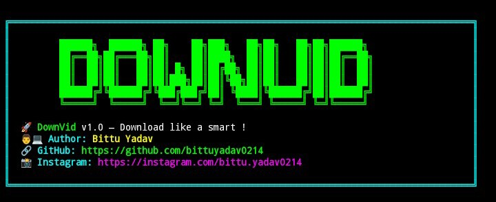
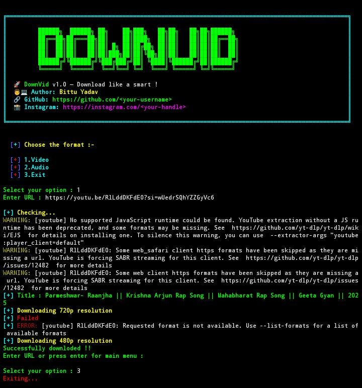
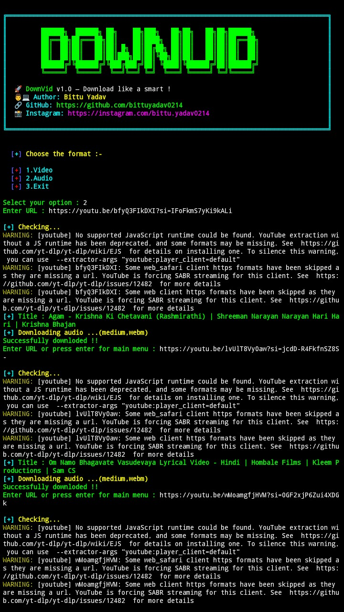

<p align="center">

</p>

# 📹 <strong> DownVid </strong>

**DownVid is a python tool that can download the Youtube content in video or audio format with best quality.It uses the yt-dlp library to download the content.DownVid download the videos & audios then save into a proper manner in a separate directory "downloads".It can download the video in several format like 720p,480p,360p and more.It is initial version of DownVid , I will give more advance feature in this tool.DownVid is an alternative to YouTube download feature because it is simple and lightweight.**
<br>

# Screenshot
<p align="center">
<br><br><br>
<br><br>

<br><br>

</p>

# ✨ Features :-
- 🎥 HD video download
- 📹 Support best quality (720p,360p)
- 🔊 Audio download (webm,mp4a)
- 📥 Simple CLI interface
- 🤖 Automatic download 
- 🤩 Free to use

<br>


# 🚨 Requirements:
 ``` 
 - Linux OS
 - Python3
 - Python3-pip3 or pip
 - Bash shell
 - git
 ```
 
 <br>
 
# 🛑 Installation Linux :
 ``` bash
 git clone https://github.com/bittuyadav0214/DownVid.git
 cd DownVid
 chmod +x *.*
 sudo python3 install.py
 ```
 <br>
 
 
# 🛑 Usage :
``` bash
python3 downvid.py
```
<br>

# ❗ Attention :
**If any error occur in the tool , try to solve it manually because it may be your local system problem.If you can't able to solve it then you can also report me about error occurred in tool ,So I will fix it.**

<br>

# ⚓ Current Version :
    DownVid 1.0
   
   
<br>

#  👨‍💻  Author :
Bittu Yadav


<br>

# 📜 Lisence :
MIT Lisence